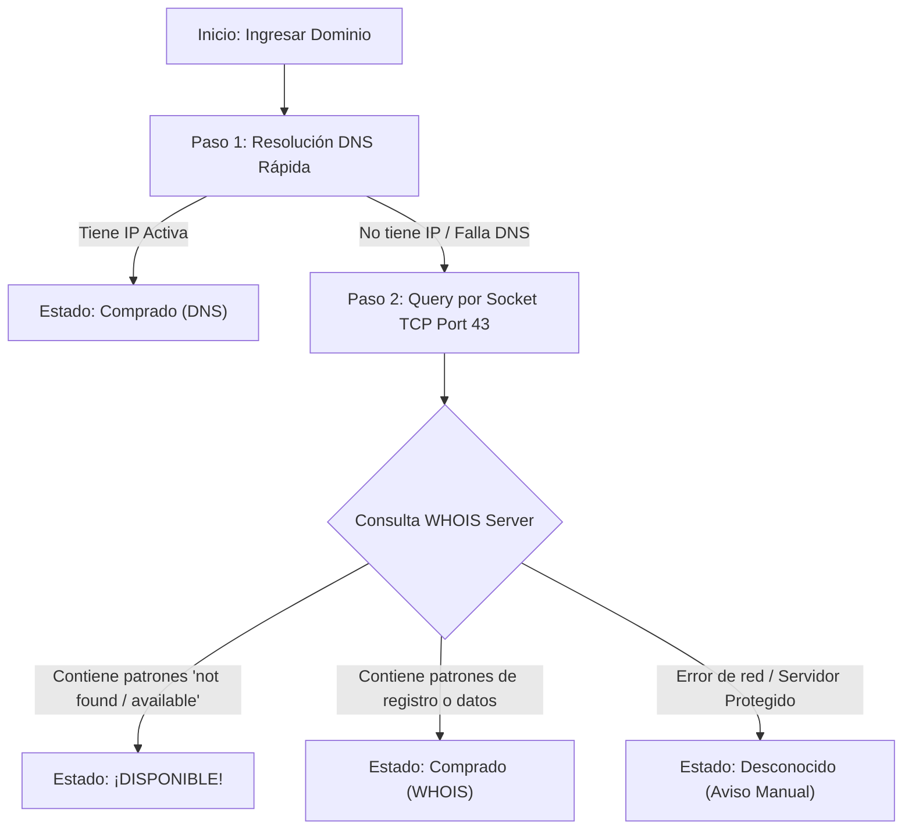

<p align="center">
  
</p>

# 🔎 LiberDom - Detector & Buscador de Dominios para Termux 🚀

[](https://termux.com/)
[](https://www.python.org/)
[](README.md)
[](LICENSE)

**LiberDom** es una herramienta en consola diseñada y optimizada especialmente para **Termux** y sistemas Linux. Permite verificar de manera instantánea si un dominio de internet está disponible para comprar o si ya tiene dueño (comprado). 
¡Perfecto para desarrolladores, emprendedores y sysadmins que necesitan buscar nombres rápidos para sus proyectos directamente desde su celular o terminal portátil! 📱💻

---

## 🌟 Características Destacadas

*   ⚡ **Búsqueda Híbrida Inteligente:** Combina una resolución DNS ultrarrápida junto con un cliente WHOIS puro recursivo a nivel de sockets TCP.
*   📦 **Sin Dependencias (Zero-Dependency):** Escrito completamente en Python estándar. **No requiere instalar molestos paquetes pip ni librerías C extras** que suelen fallar en Termux. ¡Funciona al instante!
*   🌍 **Soporte de TLDs Mundial:** Soporte de dominios globales (`.com`, `.net`, `.org`), dominios modernos (`.io`, `.co`, `.dev`) y dominios regionales de habla hispana (`.es`, `.mx`, `.cl`, `.ar`, `.pe`, `.co`, etc.).
*   🎨 **Interfaz Visual Premium:** Colores vivos ANSI adaptados para Termux, barra de carga animada (spinner) y emojis interactivos.
*   📂 **Búsqueda por Lote:** Analiza dominios cargando un archivo `.txt` o **pegando el texto directamente en la consola** (separados por comas, espacios o saltos de línea).
*   💡 **Generador Creativo:** Introduce una palabra clave y el script generará ideas combinando prefijos, sufijos y extensiones, comprobando la disponibilidad de todas ellas en tiempo real.

---

## 📥 Instalación Rápida en Termux

Para instalar todas las dependencias y dejar la herramienta configurada con comando de acceso directo, abre tu aplicación **Termux** y copia y pega la siguiente línea de comandos:

```bash
pkg install git -y && git clone https://github.com/NeoTurcios/liberdom.git && cd liberdom && chmod +x install.sh && ./install.sh
```

*(Nota: Asegúrate de cambiar `TU_USUARIO` por tu usuario de GitHub una vez crees el repositorio público).*

### Instalación Manual (Paso a Paso)

Si prefieres hacerlo de forma individual, ejecuta:

1. **Actualizar el sistema de Termux:**
   ```bash
   pkg update && pkg upgrade -y
   ```
2. **Instalar Python y Git:**
   ```bash
   pkg install python git -y
   ```
3. **Clonar este repositorio:**
   ```bash
   git clone https://github.com/NeoTurcios/liberdom.git
   cd liberdom
   ```
4. **Dar permisos de ejecución e instalar:**
   ```bash
   chmod +x install.sh
   ./install.sh
   ```

---

## 🎮 Modo de Uso

Una vez instalado, inicia la aplicación simplemente escribiendo:

```bash
liberdom
```

*(O de forma directa en la carpeta con `./liberdom.py`)*

### Menú Principal del Script:

```text
╔═══════════════════════════════════════════════════════════════╗
║  ██████╗ ██╗   ██╗███████╗ ██████╗ █████╗ ██████╗  ██████╗███╗   ███╗  ║
║  ██╔══██╗██║   ██║██╔════╝██╔════╝██╔══██╗██╔══██╗██╔════╝████╗ ████║  ║
║  ██████╔╝██║   ██║███████╗██║     ███████║██████╔╝██║     ██╔████╔██║  ║
║  ██╔══██╗██║   ██║╚════██║██║     ██╔══██║██╔══██╗██║     ██║╚██╔╝██║  ║
║  ██████╔╝╚██████╔╝███████║╚██████╗██║  ██║██║  ██║╚██████╗██║ ╚═╝ ██║  ║
║  ╚══════╝  ╚═════╝ ╚══════╝ ╚═════╝╚═╝  ╚═╝╚═╝  ╚═╝ ╚═════╝╚═╝     ╚═╝  ║
╠═══════════════════════════════════════════════════════════════╣
║         🔍  Buscador y Detector de Dominios Libre  🔍         ║
║                     ¡Optimizado para Termux!                  ║
╚═══════════════════════════════════════════════════════════════╝

💻  MENÚ PRINCIPAL EN ESPAÑOL  💻

 [1] 🔍 Buscar un dominio individual
 [2] 📂 Buscar por lote (archivo txt o texto pegado)
 [3] 💡 Generador de nombres + Verificar disponibilidad
 [4] 📘 Guía de ayuda / Consejos
 [5] 👋 Salir del script
```

### Explicación de Opciones:

1. **Buscar dominio individual:** Escribe cualquier dominio (ej. `miweb.com`) y el sistema te dirá al instante si está comprado o disponible, junto a detalles de registro como la IP del servidor o la fecha de creación en caso de estar ocupado.
2. **Buscar por lote (archivo .txt o texto pegado):** Comprueba múltiples dominios en segundos. Puedes elegir cargar un archivo `.txt` existente o **pegar el bloque de texto directamente en la consola** (por ejemplo, copiados de una web o chat, separados por comas o saltos de línea). El sistema limpiará automáticamente espacios vacíos, comentarios, duplicados y protocolos.
3. **Generador de nombres:** Escribe un término (ej: `tienda`) y elige extensiones. El script creará combinaciones de marca (`tiendahub.com`, `gotienda.net`, `tiendadev.co`) y las verificará automáticamente para ver cuáles están libres para que las registres.

---

## ⚙️ ¿Cómo funciona bajo el capó?

La mayoría de scripts de detección usan APIs de terceros que cobran o tienen fuertes limitaciones de cuotas por minuto. **LiberDom** utiliza un sistema autónomo de consulta en dos fases:



---

## 🌐 Versión Web Premium (Visual & Masiva)

¡LiberDom ahora cuenta con una interfaz web moderna, responsiva e interactiva! Ubicada en la carpeta `/web/` de este repositorio.

### Características de la Versión Web:
*   🖥️ **Estética de Vanguardia:** Interfaz con efectos de neón flotantes, paneles de vidrio esmerilado (glassmorphism) y modo oscuro premium.
*   ⚡ **Búsqueda Masiva en Paralelo:** El escáner masivo de la web procesa múltiples consultas de dominios de forma simultánea mediante peticiones JavaScript optimizadas en paralelo, inyectando tarjetas visuales a medida que terminan.
*   💾 **Exportación Directa:** Descarga reportes completos de disponibilidad de dominios en archivos `.txt` generados al instante.

### Cómo ejecutar la versión web localmente:
1.  **Ingresa a la carpeta web:**
    ```bash
    cd web
    ```
2.  **Instala las dependencias (Flask):**
    ```bash
    pip install -r requirements.txt
    ```
3.  **Inicia el servidor Flask:**
    ```bash
    python app.py
    ```
4.  **Abre en tu navegador:**
    Ingresa a la dirección local [http://127.0.0.1:5000](http://127.0.0.1:5000) en cualquier navegador web.

---

## ⚠️ Consejos Importantes (Rate Limiting)

Los servidores oficiales de WHOIS limitan la cantidad de solicitudes por minuto para evitar abusos de red (Spam).
*   Si realizas búsquedas masivas muy rápidas, algunos servidores responderán de forma vacía o bloqueada. Verás el estado como `DESCONOCIDO`.
*   **Recomendación:** Espera unos minutos entre análisis muy grandes o utiliza una red diferente (datos móviles o VPN).

---

## 🤝 Contribuciones y Soporte

¡Este proyecto es 100% libre y público! Si te ayudó en tus proyectos o te gusta:
1. Dale una **Estrella ⭐** al repositorio en GitHub.
2. Haz un **Fork** y añade nuevas mejoras.
3. ¡Compártelo con más desarrolladores y entusiastas de Termux!

Desarrollado con amor para la comunidad hispana. 💻✨
