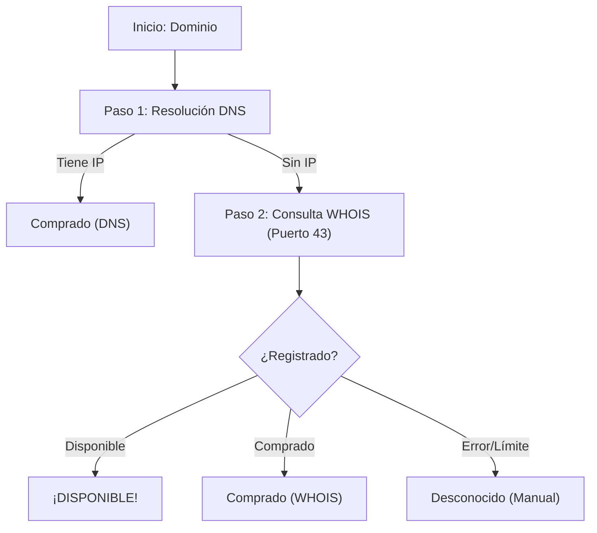

<p align="center">
  
</p>

<h1 align="center">🔎 LiberDom</h1>
<p align="center">
  <strong>El detector y buscador de dominios híbrido ultrarrápido diseñado para Termux y la Web.</strong>
</p>

<p align="center">
  <a href="https://termux.com/"></a>
  <a href="https://www.python.org/"></a>
  <a href="LICENSE"></a>
  <a href="README.md"></a>
</p>

---

> [!TIP]
> **LiberDom** es una herramienta de código abierto en español para comprobar disponibilidad de dominios en milisegundos. Combina consultas DNS ultrarrápidas y sockets TCP recursivos de bajo nivel a bases de datos mundiales de WHOIS (puerto 43), **100% libre de APIs de pago o cuotas de terceros**.

---

## 🌟 Características Clave

*   ⚡ **Búsqueda Híbrida Inteligente:** Primero realiza una resolución DNS en milisegundos (infinitas consultas y sin límites). Si no hay IP activa, cae automáticamente en un cliente WHOIS puro de bajo nivel para verificar si está comprado o libre.
*   📦 **Sin Dependencias (Zero-Dependency):** Escrito en Python nativo puro. Olvídate de instalar pesadas dependencias pip o compiladores C que suelen fallar en Termux. ¡Funciona desde el primer segundo!
*   🌍 **Cliente WHOIS Recursivo Mundial:** Capacidad de consultar `whois.iana.org` dinámicamente y redirigir la consulta al servidor de registro correspondiente de cualquier TLD regional (`.es`, `.mx`, `.pe`, `.cl`, `.ar`, etc.) o global (`.com`, `.net`, `.org`, `.io`, `.co`).
*   🎨 **Estética de Consola Premium:** Banner Matrix dinámico, colores ANSI vivos y spinner de carga diseñado para brillar en la terminal de Termux.
*   📂 **Escáner Masivo Avanzado (Lotes):** Carga listas de dominios desde un archivo `.txt` o **pega texto libre directamente en la pantalla** (copiado de WhatsApp o webs). El script limpia protocolos (`http/https`), subdominios (`www`) y elimina duplicados automáticamente.
*   💡 **Generador Creativo de Ideas:** Introduce una palabra clave y genera combinaciones con múltiples prefijos y sufijos, comprobando su disponibilidad en tiempo real.

---

## 📥 Instalación en Termux

Abre tu aplicación **Termux** y ejecuta esta única línea de comandos para instalar dependencias y configurar el acceso directo de forma automática:

```bash
pkg install git -y && git clone https://github.com/NeoTurcios/liberdom.git && cd liberdom && chmod +x install.sh && ./install.sh
```

<details>
<summary>💡 Ver instalación manual paso a paso</summary>
<br>

Si prefieres inicializar cada componente manualmente:

1. **Actualiza los repositorios de tu terminal Android:**
   ```bash
   pkg update && pkg upgrade -y
   ```
2. **Instala Git y Python 3:**
   ```bash
   pkg install python git dnsutils -y
   ```
3. **Clona este repositorio en tu almacenamiento local:**
   ```bash
   git clone https://github.com/NeoTurcios/liberdom.git
   cd liberdom
   ```
4. **Configura permisos y ejecuta el instalador del alias:**
   ```bash
   chmod +x install.sh
   ./install.sh
   ```
</details>

---

## 🎮 Modo de Uso (CLI)

Una vez completada la instalación, puedes abrir la herramienta desde cualquier directorio de Termux escribiendo:

```bash
liberdom
```

*(O ejecutando directamente en la carpeta: `./liberdom.py`)*

### Menú Principal de la Consola:
```text
╔═══════════════════════════════════════════════════════════════╗
║  ██╗     ██╗██████╗ ███████╗██████╗ ██████╗  ██████╗ ███╗   ███╗║
║  ██║     ██║██╔══██╗██╔════╝██╔══██╗██╔══██╗██╔═══██╗████╗ ████║║
║  ██║     ██║██████╔╝█████╗  ██████╔╝██║  ██║██║   ██║██╔████╔██║║
║  ██║     ██║██╔══██╗██╔══╝  ██╔══██╗██║  ██║██║   ██║██║╚██╔╝██║║
║  ███████╗██║██████╔╝███████╗██║  ██║██████╔╝╚██████╔╝██║ ╚═╝ ██║║
║  ╚══════╝╚═╝╚═════╝ ╚══════╝╚═╝  ╚═╝╚═════╝  ╚═════╝ ╚═╝     ╚═╝║
╠═══════════════════════════════════════════════════════════════╣
║         🔍    LiberDom - Detector de Dominios Libre    🔍      ║
║                     ¡Optimizado para Termux!                  ║
╚═══════════════════════════════════════════════════════════════╝

💻  MENÚ PRINCIPAL EN ESPAÑOL  💻

 [1] 🔍 Buscar un dominio individual
 [2] 📂 Buscar por lote (archivo txt o texto pegado)
 [3] 💡 Generador de nombres + Verificar disponibilidad
 [4] 📘 Guía de ayuda / Consejos
 [5] 👋 Salir del script
```

### Explicación de Opciones:
1. **Buscar dominio individual:** Comprueba cualquier dominio y el sistema te dirá al instante si está comprado o disponible, junto a detalles de registro como la IP del servidor, registrador oficial o fecha de creación si está ocupado.
2. **Buscar por lote (archivo .txt o texto pegado):** Comprueba listas de dominios en segundos cargando un archivo `.txt` existente o **pegando el bloque de texto directamente en la consola** (por ejemplo, copiados de una web o chat).
3. **Generador de nombres:** Escribe un término clave (ej: `tienda`) y el script creará marcas combinando sufijos y prefijos, verificándolos en tiempo real.

---

## 🌐 Versión Web Premium (Visual & Masiva)

¡Ahora también disponible con una increíble y moderna interfaz gráfica web responsiva! Ubicada en la carpeta `/web/` de este repositorio.

> [!NOTE]
> La versión web incluye **escaneo masivo en paralelo** con concurrencia controlada en JavaScript, tarjetas responsivas con efecto de vidrio esmerilado (*glassmorphism*), fondos de neón flotantes difuminados y descargas directas de **reportes corporativos en formato PDF moderno** y TXT.

<details>
<summary>🚀 Cómo arrancar la Web de LiberDom localmente</summary>
<br>

1. **Ingresa a la carpeta del servidor web:**
   ```bash
   cd web
   ```
2. **Instala Flask (única dependencia requerida):**
   ```bash
   pip install -r requirements.txt
   ```
3. **Enciende el servidor local:**
   ```bash
   python app.py
   ```
4. **Abre tu navegador de preferencia:**
   Accede a la dirección local [http://127.0.0.1:5000](http://127.0.0.1:5000).
</details>

---

## 🤖 Bot de Telegram (Autónomo & Multi-idioma)

¡Ahora puedes llevar **LiberDom** a tus grupos y chats de Telegram! Hemos desarrollado un bot autónomo e inteligente escrito en Python nativo puro, **100% libre de dependencias externas** y con soporte i18n total.

> [!NOTE]
> El bot responde al instante con tarjetas estilizadas cuando le envías cualquier dominio en texto plano (ej: `web.com`), comandos de consulta, o botones interactivos de selección de idioma (`es` o `en`).

<details>
<summary>🚀 Cómo iniciar tu Bot de Telegram en segundos</summary>
<br>

1. **Crea tu Bot con BotFather:**
   - Abre Telegram y busca al bot oficial [@BotFather](https://t.me/BotFather).
   - Envía `/newbot` y sigue las instrucciones en pantalla para elegir nombre y un usuario público terminado en `_bot`.
   - Copia el **Token API** que te asigne (ej: `123456789:ABCdefGhIJKlmNoPQRsTUVwxyZ`).

2. **Enciende el motor del Bot:**
   - Abre tu terminal en la carpeta del proyecto y ejecuta:
     ```bash
     python telegram_bot.py
     ```
   - El script detectará que es el primer inicio y te solicitará pegar tu **Bot Token** en la consola.
   - ¡Listo! El token se guardará de forma segura y persistente en `.telegram_bot_config.json`, y el bot comenzará a escuchar mensajes en tiempo real.

3. **Interactúa en Telegram:**
   - Abre el chat con tu nuevo bot, presiona **Iniciar** y envíale cualquier dominio directamente para ver los resultados técnicos detallados en milisegundos.
</details>

---

## ⚙️ ¿Cómo funciona bajo el capó?

La mayoría de scripts de detección usan APIs de terceros limitadas o de pago. **LiberDom** utiliza un sistema autónomo de consulta en dos fases:



---

## ⚠️ Consejos Importantes (Rate Limiting)

Los servidores oficiales de WHOIS limitan la cantidad de solicitudes por minuto para evitar abusos de red (Spam).
*   Si realizas búsquedas masivas muy rápidas en modo híbrido, algunos servidores responderán de forma vacía o bloqueada y verás el estado `DESCONOCIDO`.
*   **Recomendación:** Espera unos minutos entre análisis muy grandes, aumenta el retraso de seguridad recomendado por el script, o utiliza el **Modo Ultra-Rápido (Solo DNS)** el cual es inmediato e inmune a los bloqueos de IP.

---

## 🌐 Soporte Multi-idioma (i18n) / Multi-language Support

¡LiberDom ahora es **internacional**! Hemos implementado un sistema completo de internacionalización (i18n) en la versión de terminal de Termux (CLI) y en el panel web visual, permitiendo alternar idioma sin reiniciar.

### 📊 Estadísticas y Estado de Traducción

| Idioma | Código ISO | CLI (Termux) | Web App | Estado |
| :--- | :---: | :---: | :---: | :--- |
| 🇪🇸 Español | `es` | `100%` | `100%` | Completado (Nativo) |
| 🇺🇸 Inglés | `en` | `100%` | `100%` | Completado (Oficial) |

---

### ✍️ Cómo Contribuir con Nuevos Idiomas (How to Translate)

¡Cualquier aporte para traducir LiberDom a nuevos idiomas (como Portugués, Francés, Italiano, etc.) es sumamente apreciado!

#### 1. En la versión de Consola CLI:
Abre el archivo [liberdom.py](liberdom.py) y agrega la traducción de tu idioma al diccionario `TEXTS`:
```python
TEXTS = {
    "es": { ... },
    "en": { ... },
    "tu_codigo_iso": {
        "banner_sub": "¡Mensaje de banner!",
        # Traduce cada una de las claves de texto...
    }
}
```

#### 2. En la versión Web:
- Abre el archivo [web/static/script.js](web/static/script.js) y agrega tu idioma al diccionario `translations`:
```javascript
const translations = {
    es: { ... },
    en: { ... },
    tu_codigo_iso: {
        "nav.single": "Individual (Translated)",
        # Traduce cada una de las claves correspondientes...
    }
};
```
- Abre el archivo [web/templates/index.html](web/templates/index.html) y agrega tu opción al dropdown de la barra superior:
```html
<div class="lang-dropdown" id="lang-dropdown">
    <button class="lang-option" data-lang="es"><span class="flag">🇪🇸</span> Español</button>
    <button class="lang-option" data-lang="en"><span class="flag">🇺🇸</span> English (Official)</button>
    <button class="lang-option" data-lang="tu_codigo_iso"><span class="flag">🏳️</span> Tu Idioma</button>
</div>
```

---

## 🤝 Contribuciones y Soporte

¡Este proyecto es 100% libre y público! Si te ayudó en tus proyectos o te gusta:
1. Dale una **Estrella ⭐** al repositorio en GitHub.
2. Haz un **Fork** y añade nuevas mejoras.
3. ¡Compártelo con más desarrolladores y entusiastas de Termux!

Desarrollado con amor para la comunidad hispana por **NeoTurcios**. 💻✨
