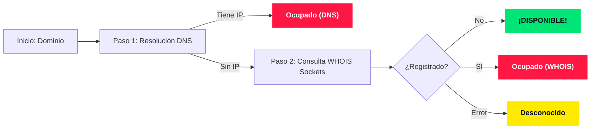

<p align="center">
  
</p>

<h1 align="center">🔎 OpenFind AI</h1>
<p align="center">
  <strong>El detector y buscador de dominios híbrido inteligente y ultrarrápido diseñado para Termux, la Web y Android.</strong>
</p>

<p align="center">
  <a href="https://termux.com/"></a>
  <a href="https://www.python.org/"></a>
  <a href="LICENSE"></a>
  <a href="README.md"></a>
</p>

---

> [!TIP]
> **OpenFind AI** es una herramienta de código abierto para comprobar la disponibilidad de dominios en milisegundos. Combina consultas DNS ultrarrápidas, sockets TCP recursivos a nivel de red WHOIS (puerto 43), y un generador inteligente asistido por IA para ideas de marcas. **¡100% libre de APIs de pago o cuotas de terceros!**

---

## 🌟 Características Clave

*   ⚡ **Búsqueda Híbrida Inteligente:** Primero realiza una resolución DNS instantánea (sin límites ni costos). Si no detecta una IP activa, conmuta a un cliente WHOIS puro de bajo nivel (Sockets TCP) para comprobar si está libre.
*   📦 **Cero Dependencias en CLI:** Escrito en Python nativo puro. Ideal para Termux y servidores ligeros sin necesidad de instalar compiladores C o librerías pesadas.
*   🌍 **Conexión WHOIS Recursiva Mundial:** Consulta dinámicamente `whois.iana.org` y redirige de forma automática al servidor correspondiente para cualquier TLD global (`.com`, `.net`, `.io`) o regional (`.es`, `.mx`, `.cl`, etc.).
*   🎨 **Estética de Terminal Matrix:** Banner dinámico de inicio, colores ANSI vivos y spinner de carga diseñado para brillar en la terminal de Termux.
*   📂 **Búsqueda Masiva en Lote:** Carga listas de dominios desde un archivo `.txt` o pega texto libre directamente. El sistema limpia protocolos, subdominios y descarta duplicados de forma inteligente.
*   💡 **Generador Inteligente con IA:** Genera ideas creativas de dominios combinando palabras clave con prefijos, sufijos y opciones de inteligencia artificial (`ai`, `my...ai`) comprobando su disponibilidad en tiempo real.

---

## 📥 Instalación en Termux

Abre tu aplicación **Termux** y ejecuta esta única línea para clonar e instalar el alias rápido de forma totalmente automatizada:

```bash
pkg install git -y && git clone https://github.com/NeoTurcios/openfind.git && cd openfind && chmod +x install.sh && ./install.sh
```

Una vez completada la instalación, puedes abrir la herramienta desde cualquier directorio escribiendo:

```bash
openfind
```

*(O ejecutando directamente en la carpeta: `./openfind.py`)*

---

## 📱 Cliente Android Nativo (OpenFind AI - Premium)

¡OpenFind AI incluye una **aplicación nativa para teléfonos inteligentes** en la carpeta `/android/`!

*   🎯 **Compilada para Android 16 (SDK 36):** Soporta los últimos estándares de Google (con soporte retrospectivo desde SDK 26).
*   🚀 **Estructura Modernizada de Kotlin:** Desarrollada bajo arquitectura Kotlin moderna bajo el paquete limpio `openfind.ai`.
*   🌐 **Idioma Dinámico en la Barra Flotante:** Soporte multi-idioma (Español/Inglés) que traduce de manera dinámica toda la interfaz, incluyendo la barra de navegación flotante tipo isla.
*   📂 **Biblioteca Inteligente Limitada a 10 Elementos:** Mantiene la app rápida y limpia guardando solo los 10 dominios favoritos e historial más recientes de forma automatizada.
*   📊 **Exportación PDF Nativa:** Genera reportes técnicos y corporativos de disponibilidad y compártelos al instante.
*   🎨 **Diseño Oscuro Glassmorphism:** Interfaz interactiva de alta fidelidad con bordes neón que responden dinámicamente al estado del dominio analizado.

### Cómo compilar localmente:
1. Dirígete a la carpeta: `cd android`
2. Genera la compilación: `./gradlew assembleDebug`
3. APK resultante en: `app/build/outputs/apk/debug/app-debug.apk`

---

## 🌐 Versión Web Responsiva (Flask + Glassmorphism)

El panel web visual está ubicado en la carpeta `/web/`.

> [!NOTE]
> La versión web incluye **escaneo masivo en paralelo** con concurrencia controlada en JavaScript, tarjetas responsivas glassmorphism y descargas de reportes en PDF y TXT.

### Cómo encender la Web localmente:
1. Entra a la carpeta: `cd web`
2. Instala los requerimientos: `pip install -r requirements.txt`
3. Enciende el servidor Flask: `python app.py`
4. Navega a: [http://127.0.0.1:5000](http://127.0.0.1:5000)

---

## 🤖 Bot de Telegram Autónomo

Activa el bot en segundos para buscar dominios de forma conversacional:
1. Inicia el bot: `python telegram_bot.py`
2. Pega tu Bot Token de [@BotFather](https://t.me/BotFather) en la consola cuando se solicite.
3. Envía cualquier dominio directamente en chat y obtén respuestas técnicas en milisegundos.

---

## ⚙️ ¿Cómo funciona bajo el capó?



---

## 📄 Licencia y Atribución

Este proyecto se distribuye bajo una **Licencia Personalizada de Uso No Comercial y Atribución Obligatoria**.

*   **Uso No Comercial Estricto (Prohibido monetizar):** Queda estrictamente prohibido vender, alquilar, sublicenciar, comercializar o usar este software o cualquier parte de su código fuente para beneficio comercial directo o indirecto. **No está permitido colocar anuncios (Ads) en la Play Store o Web.**
*   **Requisito de Atribución Obligatoria:** Al publicar o redistribuir versiones (modificadas o compiladas) de este software, **debes mantener visible en la interfaz** el enlace al repositorio original de GitHub del motor LiberDom en el cual está basado:  
    `https://github.com/NeoTurcios/openfind`

---

Desarrollado con pasión y código abierto. ¡Disfruta de **OpenFind AI**! 🚀
